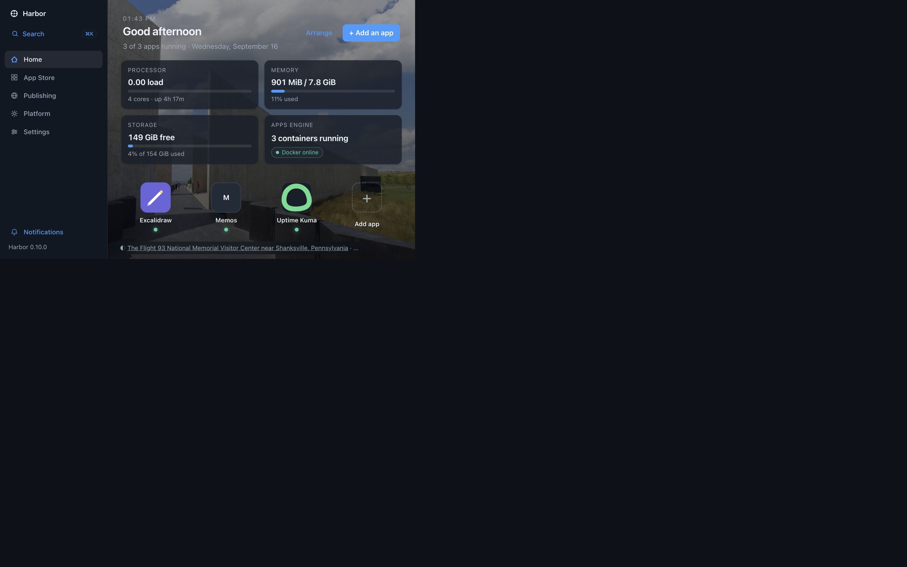
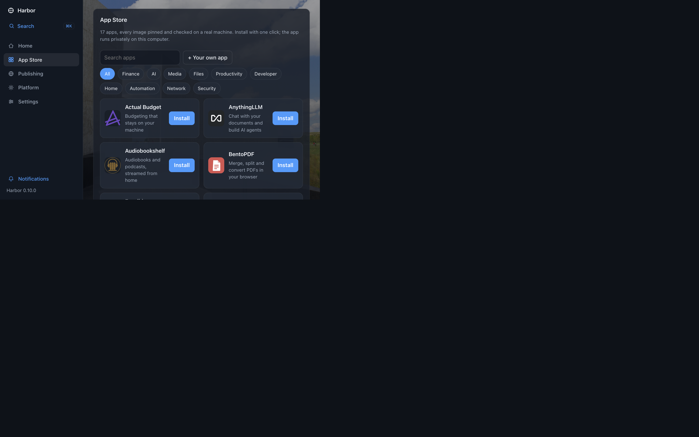
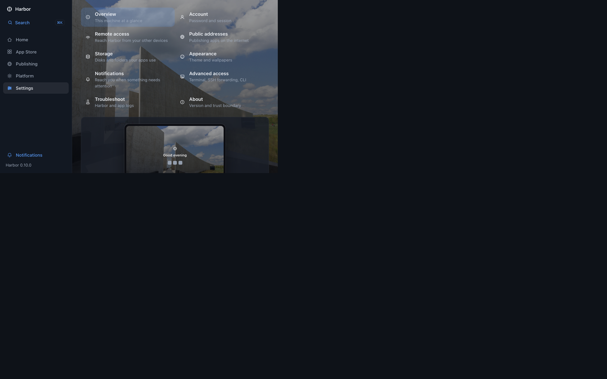

# Harbor — your own cloud, on your own machine

**Like the cloud, but you own it.** Harbor turns one Ubuntu machine into a private home for
your apps: photos, files, notes, media, passwords, automations, an AI assistant — installed
with one click, kept running, reachable from anywhere you choose.

```sh
curl -fsSL https://raw.githubusercontent.com/carlosalaniz/harbor/main/install.sh | sudo bash
```

One command. A few minutes. Then open **http://harbor.local**, create your account, and
install your first app. No Docker knowledge, no YAML, no terminal required after setup.



## Why Harbor

- **One click, really.** Pick an app in the App Store, press Install, open it. Harbor handles
  ports, volumes, secrets, health checks and updates — and rolls back automatically if a new
  version misbehaves.
- **Your data stays yours.** Everything runs on your machine, under your roof. No accounts
  with a vendor, no subscription meter, no telemetry phoning home.
- **Reach it your way.** Private by default on your machine; opt in to your home network
  (`http://harbor.local`), your private Tailscale tailnet (HTTPS, anywhere), or the public
  internet (automatic Let's Encrypt certificates) — per app, your call.
- **Honest by design.** Every change is previewed as a plan before it runs. Every app shows
  plain-words status with the technical detail one tap away. Nothing is hidden, nothing is magic.



## What's inside

**17 apps, ready to install** — Excalidraw, BentoPDF, n8n, Open WebUI (with local Ollama models),
AnythingLLM, Jellyfin, Immich, Nextcloud (files + office), Vaultwarden, Uptime Kuma, Forgejo,
FreshRSS, Actual Budget, Audiobookshelf, Navidrome, Memos, Mealie. Every image pinned by digest
and qualified on a real machine. Apps with big data (photos, media, files) can live in a folder
of yours instead of a Docker volume.

**Plus your own apps** — upload a zip or point Harbor at a git repo; every push can redeploy
automatically. See [Build your own app](docs/DEVELOPER_PACKAGES.md).



**A console that respects you** — a launcher home screen that greets you by name, system health
at a glance, per-app usage, notifications (console, ntfy, webhook, email), rotating wallpapers,
a ⌘K palette, a terminal and logs when you want them, and settings a non-technical person can
actually use (password + two-factor, tailnet, domains, storage picker, appearance).

## Get started

- **Install Harbor:** [Operator guide](docs/OPERATOR_GUIDE.md) — requirements, the one-line
  installer, access (LAN / tailnet / public), lifecycle, troubleshooting, trust boundary.
- **Build an app for Harbor:** [Developer guide](docs/DEVELOPER_PACKAGES.md) — package template,
  the Compose subset, uploads, git sources, updates.
- **Work on Harbor:** [AGENTS.md](AGENTS.md) — rules of engagement for contributors and agents.
- **All docs:** [docs/](docs/README.md) — the full map.

## Status

Harbor is a **trusted local preview** (v0.10.0): one administrator, one daemon with Docker
authority. It is not a hardened multi-user service. See
[what's deliberately not built](docs/FUTURE.md) and the [evidence log](docs/VERIFICATION.md)
for what was actually verified, where, and how.
