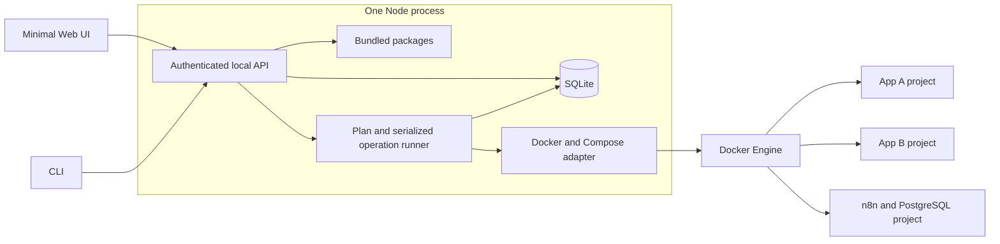

# Harbor — simple first release

**Version:** 1.0 of the autonomous-build handoff  
**Date:** 2026-09-13  
**Companion:** [plan.md](plan.md)

## 0. Read this first

You are building a small self-hosted application manager from scratch. **This document and plan.md are the complete requirements.** Do not search for an earlier conversation, another specification, existing application source, or a particular server. Public dependency/upstream documentation may be consulted for implementation details and supported versions; no private context is required.

Build in the new repository/environment supplied for implementation. Possession of these documents is not authorization to deploy onto the machine storing them. Host-level integration tests, package installation, Docker changes, and reboot tests belong on an explicitly designated disposable Ubuntu VM. Never use an unrelated production Docker socket.

The goal is a **working, simple first release**, not the mature infrastructure product described by some application managers. Prefer one process, ordinary functions, one database, a bundled catalog, and a small UI. Do not implement a generic platform before an application works.

The finish line is the demo in section 1 and the acceptance tests in section 12. Follow plan.md in order and stop after its required phases. Excluded features are not extra tasks to implement autonomously. Section 14 provides future integration context only; it must not expand that finish line.

## 1. Product and finish line

Harbor lets one administrator install several self-hosted applications on one Linux machine. Packages describe deployments; Harbor allocates nonconflicting resources, starts normal Docker Compose projects, verifies readiness, and remembers what it owns.

The primary journey is:

> Bootstrap Harbor → log in → see a catalog → install an app → open it → install another app → both keep working.

### Required demo

On a clean, designated Ubuntu test VM:

1. Install Harbor using its built bootstrap artifact, without Node/npm build tooling already on that VM.
2. Enroll the one Harbor administrator locally and log into the minimal Web UI.
3. See Excalidraw, BentoPDF, and n8n in Available applications.
4. Install Excalidraw, open it, create a drawing, and export it.
5. Install BentoPDF using the same package path; perform a basic PDF operation.
6. Install n8n with its private PostgreSQL service, finish n8n's own account setup, and run a test workflow.
7. Excalidraw remains usable throughout. No existing application is recreated when another is installed.
8. Open Cockpit and Portainer from Harbor's Platform tools cards.
9. Restart Harbor: applications continue running and the UI recovers its state after login.
10. Reboot the VM: desired-running applications return and Harbor reports actual readiness.
11. Stop one instance, reboot, and verify that instance remains stopped while the others run.
12. Remove n8n, retaining its data; reinstall the exact same release into the retained instance and verify workflow and credential usability.

The first development checkpoint is only Excalidraw + BentoPDF through the CLI. Add the minimal UI immediately afterward, then n8n. Do not wait for backups, updates, or sophisticated recovery to demonstrate coexistence.

### Scope

**Required:** three real bundled packages, multiple instances, local API/CLI, minimal Web UI, one administrator, serialized durable operations, plan confirmation, readiness, start/stop/remove/reinstall-retained, basic bootstrap, Cockpit/Portainer setup-or-bind and real links, reproducible tests/documentation.

**Not part of this build:** AFFiNE, Immich, ERPNext, Nextcloud (including AIO), OnlyOffice/Collabora integration, application upgrades, schema migrations of application data, proxy/NPM automation, public or LAN administration, certificate automation, remote/community catalogs, TUF, plugin/hooks DSL, separate privileged worker, encrypted secrets service, backups/restores, storage guards, external/network disks, disk formatting, purge, adoption, roles/SSO/MFA, notifications, SSE, Kubernetes, cloud deployment, installer auto-update, public package publication.

Those exclusions are deliberate simplification, not forgotten work. No active buttons, placeholder APIs, or claims of support for them. The preserved future backup boundary is **configuration and Harbor-owned recovery secrets only, never application databases/photos/workflows/files**. No backup code is needed now.

Harbor is a working codename; do not spend this build inventing a new brand, registering domains, or publishing namespaces. Centralize the display/CLI/label prefix so later naming work is possible.

## 2. Supported environment and access

- Application host: Ubuntu 24.04 LTS, x86-64, systemd, rootful Docker Engine and Docker Compose plugin.
- Runtime: Node.js 24 LTS, with a tested patch pinned in the implementation.
- Filesystems: always-mounted local storage for Harbor state and Docker's normal local volumes. External/removable/network volume backends are unsupported.
- Management: local browser or SSH local forwarding; API/UI binds **127.0.0.1 only**. Default port 18000, configurable at bootstrap if occupied.
- App ports: allocate IPv4 TCP on 127.0.0.1 in the default range 18080–18999. Store the allocated port; never change it silently.
- Normal browser URL: `http://localhost:<allocated-port>/`. The server always probes its actual 127.0.0.1 binding, not a caller-supplied browser URL.
- SSH use: documentation lists exact local forwards needed for UI, apps, and tools. Initially require the same local and remote port numbers. If a local port is busy, explain how to release/select it; do not pretend forwarding succeeded or republish on all interfaces.

Localhost can satisfy secure-browser-context rules that plain HTTP to a LAN IP does not. Test the actual browser behavior, especially BentoPDF and n8n secure cookies. Do not disable app security settings simply to make an unsupported exposure work. This release is a **trusted local preview**, not a hardened public management service.

The installer account has Docker access and is therefore root-equivalent. Its API is not a security sandbox against root or trusted Docker administrators. Bootstrap requires explicit root action; routine app operations run inside the daemon under a dedicated service account. Existing unrelated workloads must remain unchanged even on a trusted host.

## 3. Small architecture

Use one native Node daemon, one SQLite database, one React static UI served by that daemon, and a CLI using the same HTTP API. No Redis, message broker, worker fleet, separate API/worker RPC, or second CLI installer engine.



### Stack

| Choice | Use |
|---|---|
| TypeScript strict ESM, Node 24 | All first-party application logic |
| pnpm, one lockfile | Dependency management; no large workspace framework required |
| Fastify | API and static UI delivery |
| React + Vite | Small UI; ordinary CSS is sufficient |
| Commander | CLI |
| SQLite through better-sqlite3 | Durable state |
| JSON Schema 2020-12 + Ajv, `yaml` | Shared runtime contracts and restricted package parsing |
| Dockerode | Narrow Docker metadata/create-volume/start/stop/remove operations |
| Docker Compose plugin | Canonical model validation and standard project creation |
| Vitest, Playwright | Unit/integration and browser testing |

Use ordinary source modules: contracts, packages, planner, lifecycle, state, docker, auth, api, cli, bootstrap, tools, web. The planner/rendering functions accept data and return data; only adapters perform I/O. Do not create empty future plugin/provider systems.

### Execution boundaries

- All normal mutations go through the daemon's application service and operation queue.
- Bootstrap/enrollment are explicit local maintenance commands, not HTTP root-shell endpoints.
- The Web UI has no Docker socket, raw SQL, filesystem, or terminal capability.
- Spawn approved executables with argument arrays, fixed working directory, explicit environment, timeout and bounded output. No `shell: true`, interpolated shell command, or package-supplied host script.
- Clear Docker context/host and Compose interpolation environment inheritance. Connect to the configured local Docker socket only.
- Use instance UUIDs in generated paths and validate path containment; no input-derived arbitrary host destinations.

## 4. Package contract

The package abstraction is the most important deliverable. Adding a fourth ordinary package with already-supported fields must require **only package files and tests**, not an application-name conditional in the engine.

### 4.1 Package layout and trust

Each bundled package has `manifest.yaml`, `compose.yaml`, `release.json`, and `README.md` inside its own package directory. These filenames describe files the implementation must create, not extra input documents supplied to the agent.

The build produces a catalog index mapping package ID to revision and a contained directory. Read only this index; do not recursively discover apps on the host. Runtime treats installed bundles as immutable. No remote catalog loading or arbitrary package-path upload.

The release inventory contains:

- `schemaVersion: 1`.
- Package ID and revision matching the manifest.
- SHA-256 of exact bytes of manifest, Compose, and README (no self-hash).
- One image record per service: exact immutable `repository@sha256:<64 lowercase hex>` reference, selected upstream version/tag as provenance, architecture `linux/amd64`.
- Tested Node, Engine, Compose and app versions in release qualification output.

Image references in source Compose equal the inventory references. Verify hashes before planning and before applying. These hashes provide integrity/identity inside a locally approved build; do not describe them as independent publisher signatures.

Resolve actual digests from upstream during implementation and commit the real package files. **Never ship invented digests, placeholders, `latest`, or a dependency on a developer's cache.** If image access is unavailable, finish safe offline work and record qualification as blocked, not passed.

### 4.2 Manifest fields

Required top-level fields: `apiVersion`, `kind`, `metadata`, `release`, `deployment`, `endpoints`, `health`, `ui`. Optional: `storage`, `secrets`, `configuration`, `setup`; missing collections mean empty collections. Reject all other fields for this release.

| Field | Rule |
|---|---|
| `apiVersion` | Exactly `harbor/v1alpha1` (provisional codename namespace) |
| `kind` | Exactly `Application` |
| `metadata` | `id`, `name`, `description`; plain text, no executable HTML |
| `release` | Nonempty immutable string `revision` |
| `deployment` | `compose: compose.yaml`, boolean `multiInstance`, map `services` from actual Compose service keys to `application` or `infrastructure` |
| `endpoints` | Map from endpoint ID to `service`, `containerPort` (1–65535), `scheme: http`, `exposure: direct`, `browserContext: secure` or `ordinary` |
| `health` | `endpoint` reference, relative `path`, nonempty `expectedStatus` integer array, `timeoutSeconds` (1–30), `deadlineSeconds` (1–600) |
| `ui` | `primaryEndpoint` reference |
| `storage[]` | Unique `id`, `composeVolume`, `purpose`, `retention: retain`; local named volumes only |
| `secrets[]` | Unique `id`, `bytes: 32`, `encoding: hex`, `retention: retain`, nonempty `bindings[]` of `{service, environment}` |
| `configuration[]` | `{service, environment, endpoint}`; inject that endpoint's stable browser URL |
| `setup` | Optional `{endpoint, instructions}` for user-managed onboarding; not a script or proof of completion |

IDs use `[a-z][a-z0-9-]{0,62}`. Environment keys use `[A-Z_][A-Z0-9_]*`. References must exist. Service-role keys equal the actual Compose service keys; all volumes are accounted for exactly once. Reject duplicate target bindings, including secret/configuration overlap, and source environment literals that conflict with generated targets.

Only one HTTP readiness target is necessary now. Databases are checked through Compose health dependencies and the application's readiness endpoint. Compose is the only source of truth for bundled service dependencies: **no redundant dependency resolver**.

Parse at most 256 KiB per YAML file and bound nesting to 32. Reject multiple documents, duplicate keys, YAML aliases/merge keys, custom tags, ambiguous unsupported scalar types and non-finite numbers. Validate both structure and cross-references. Do not silently coerce booleans/numbers into configuration strings.

### 4.3 Supported Compose subset

Package root keys: `services`, optional `volumes`. Service keys: `image`, `environment` (string-valued map), `depends_on` (long form using `service_started` or `service_healthy`), `healthcheck`, `volumes` (long-form named volumes only). Healthcheck accepts an argument-array `CMD` test, interval, timeout, retries, and optional start period with bounded values. Volume declarations are empty maps; mounts have `type: volume`, declared `source`, absolute container `target`, and optional boolean `read_only`.

Harbor generates ports, restart policy, default bridge network, project identity and ownership labels. Source packages cannot override these. Reject package `container_name`, custom network/global volume names, `external`, `ports`, `restart`, host bind mounts, `env_file`, configs, secrets, build, includes/extends, command/entrypoint overrides, host namespaces, devices, capabilities, privileged mode and sockets. No package interpolation expressions such as `${...}`. No arbitrary assets need execution in this release.

Inspect image-declared persistence during package qualification. Every necessary image-declared volume must have an explicit package claim, otherwise recreation could lose anonymous data. Never “fix” an incompatible package with an app-name branch. A small general schema extension is allowed only if indispensable to a required app and tested/documented in both contracts and fixtures.

### 4.4 Example: Excalidraw

Manifest:

```yaml
apiVersion: harbor/v1alpha1
kind: Application
metadata:
  id: excalidraw
  name: Excalidraw
  description: Browser whiteboard
release:
  revision: "1"
deployment:
  compose: compose.yaml
  multiInstance: true
  services:
    web: application
endpoints:
  web:
    service: web
    containerPort: 80
    scheme: http
    exposure: direct
    browserContext: secure
health:
  endpoint: web
  path: /
  expectedStatus: [200]
  timeoutSeconds: 5
  deadlineSeconds: 90
ui:
  primaryEndpoint: web
```

Compose:

```yaml
services:
  web:
    image: excalidraw/excalidraw@sha256:EXCALIDRAW_DIGEST
```

`EXCALIDRAW_DIGEST` is an editorial placeholder, not a runtime variable. All such placeholders in these examples must be replaced with verified digests in implementation. Do not claim that the static web image includes a collaboration backend or server-side drawing storage. Qualify creating/exporting drawings in the browser.

### 4.5 Example: BentoPDF

Use the same manifest structure as Excalidraw, with the following exact differences: `metadata.id: bentopdf`, `metadata.name: BentoPDF`, description `Browser PDF tools`, and `endpoints.web.containerPort: 8080`. All other fields are the same, including the `web` service, `/` health path, and secure browser context. The implementation must materialize a complete independent manifest, not inherit another package at runtime.

Compose:

```yaml
services:
  web:
    image: ghcr.io/alam00000/bentopdf-simple@sha256:BENTOPDF_DIGEST
```

No storage claims. Qualify a basic PDF merge or page operation. Preserve upstream cross-origin isolation headers; document browser-downloaded assets and feature limitations rather than promising all functionality works offline. Observe upstream licensing and image distribution terms.

### 4.6 Example: n8n with PostgreSQL

Manifest:

```yaml
apiVersion: harbor/v1alpha1
kind: Application
metadata:
  id: n8n
  name: n8n
  description: Workflow automation with a private PostgreSQL database
release:
  revision: "1"
deployment:
  compose: compose.yaml
  multiInstance: true
  services:
    web: application
    postgres: infrastructure
endpoints:
  web:
    service: web
    containerPort: 5678
    scheme: http
    exposure: direct
    browserContext: secure
health:
  endpoint: web
  path: /healthz/readiness
  expectedStatus: [200]
  timeoutSeconds: 5
  deadlineSeconds: 180
ui:
  primaryEndpoint: web
setup:
  endpoint: web
  instructions: Complete n8n owner setup and run a test workflow.
storage:
  - id: database
    composeVolume: database
    purpose: PostgreSQL database
    retention: retain
  - id: app-state
    composeVolume: app-state
    purpose: n8n local application state
    retention: retain
secrets:
  - id: database-password
    bytes: 32
    encoding: hex
    retention: retain
    bindings:
      - {service: postgres, environment: POSTGRES_PASSWORD}
      - {service: web, environment: DB_POSTGRESDB_PASSWORD}
  - id: encryption-key
    bytes: 32
    encoding: hex
    retention: retain
    bindings:
      - {service: web, environment: N8N_ENCRYPTION_KEY}
configuration:
  - {service: web, environment: N8N_EDITOR_BASE_URL, endpoint: web}
  - {service: web, environment: WEBHOOK_URL, endpoint: web}
```

Compose:

```yaml
services:
  postgres:
    image: postgres@sha256:POSTGRES_DIGEST
    environment:
      POSTGRES_USER: n8n
      POSTGRES_DB: n8n
    healthcheck:
      test: [CMD, pg_isready, -U, n8n, -d, n8n]
      interval: 5s
      timeout: 3s
      retries: 20
    volumes:
      - {type: volume, source: database, target: /var/lib/postgresql/data}
  web:
    image: n8nio/n8n@sha256:N8N_DIGEST
    environment:
      DB_TYPE: postgresdb
      DB_POSTGRESDB_HOST: postgres
      DB_POSTGRESDB_PORT: "5432"
      DB_POSTGRESDB_DATABASE: n8n
      DB_POSTGRESDB_USER: n8n
      DB_POSTGRESDB_SCHEMA: public
      GENERIC_TIMEZONE: UTC
      TZ: UTC
      N8N_ENFORCE_SETTINGS_FILE_PERMISSIONS: "true"
    depends_on:
      postgres: {condition: service_healthy}
    volumes:
      - {type: volume, source: app-state, target: /home/node/.n8n}
volumes:
  database: {}
  app-state: {}
```

Choose a supported PostgreSQL release whose data layout matches the mount (a qualified 16.x version is the baseline); do not accidentally substitute a different major. Select a supported n8n version, verify its runner requirements and readiness endpoint, and pin it. If a runner sidecar is required for that version, describe it as package services with narrowly extended generic bindings; do not build an installer plugin. A representative no-Code-node workflow is sufficient for the demo; document any unqualified advanced runner features.

n8n and PostgreSQL receive the same generated database password for this instance. Another n8n instance receives different keys/volumes. `.n8n` still requires persistence when PostgreSQL is used. No database port is published. `/healthz/readiness` must verify database/migration readiness; `/healthz` alone is insufficient.

User enrollment inside n8n is separate from Harbor enrollment. `setup` is guidance, not an executable hook or automatic claim of account creation. The app may be installed/healthy while its guidance remains visible. P0 tests owner login and actual workflow execution. Local callback URLs are not public webhook endpoints.

## 5. Resource allocation and generated deployments

### Identity

- Instance IDs: UUIDs, independent of package/name.
- Names: unique retained slug matching the ID pattern; default to package ID if free, otherwise propose `<package>-2`, etc.; user confirms before apply.
- Project: `hb_<instance UUID without hyphens>`.
- Network: project-default bridge; no global shared application network.
- Volume name: `<project>_<composeVolume>` with a generated opaque ownership token label.
- Labels: centralized prefix `io.harbor.preview`, with installation ID, instance ID and resource token. Store actual IDs, volume names/creation metadata and tokens in state.

Check state plus observed metadata before effects. A same-name resource not owned by this installation is a conflict, not a candidate for reuse. Docker volume names are not immutable IDs: verify the saved token/creation metadata, not just existence. This is protection against accidents, not malicious root copying labels.

The image's internal service port, allocated host port, and browser URL are distinct. Host readiness uses `127.0.0.1:<host-port><health-path>`, never the container DNS name. First verify the expected container and binding; do not probe an unrelated listener merely because it uses that port.

### Ports and admission

Serialize mutation. Choose the lowest eligible loopback TCP port from the range, sorted by endpoint ID for stable rendering. Consider stored stopped/retained instance allocations, active/queued operation claims, Docker bindings, and actual listeners including wildcard/dual-stack overlap. Plans may propose the same free port, but operation submission atomically claims it; the second submission conflicts and must re-plan.

Recheck immediately before binding. A short bind probe, if used, happens during apply and is closed before Compose uses the port; it cannot eliminate the external race. A bind failure is reported as conflict without stopping its owner or silently choosing a new port. Ordinary planning must not create containers, app directories, data volumes or secrets. Private scratch/plan bookkeeping is allowed.

### Render rules

1. Read and validate source package and hashes before invoking Compose.
2. Build a prospective model with project network, labels, loopback long-form ports, generated volume bindings, restart policy, and placeholder secrets.
3. Run non-mutating Compose canonical validation with no ambient env or undeclared file loading. This is not a regex substitute for Compose semantics.
4. After approval, create fresh owned volumes explicitly using the Docker adapter and record tokens. Generated Compose declares those allocations as external named volumes, preventing Compose from silently creating missing data on restart/reinstall. This generated `external` is not permitted in package source.
5. Generate/reuse secrets, produce private resolved environment values and exact Compose, and validate again.
6. Create/start this project with Compose. Use no cleanup flags that could delete unrelated resources or volumes.

Keep generated release material in the service-owned instance directory with mode 0700 for directories and 0600 for files containing secrets. Generate YAML structurally; do not interpolate secrets through shell or Compose variable expansion. Qualification must test correct escaping of literal dollar signs in any supported nonsecret fields too.

Use `unless-stopped` for ordinary long-running services. It is acceptable for Docker to restart a partly created app after a daemon crash: the operation remains `needs_action`, not falsely succeeded. Do not build a restart-policy handoff protocol for this preview. Successful desired-running workloads restart through Docker without Harbor. Successful stops remain stopped after host reboot.

## 6. State, plans, and operations

### Minimal persistence

SQLite on local storage: WAL, `synchronous=FULL`, foreign keys, short transactions, schema version. A singleton process lock protects daemon and local maintenance access. Never hold a SQL transaction during network/Compose waits. State failure blocks mutation; do not replace corrupt state with a fresh database.

Required tables (JSON columns for small immutable nested records are fine):

| Table | Required columns/invariants |
|---|---|
| installation | Singleton UUID, schema version, bootstrap config; initialized explicitly, not on accidental missing DB |
| administrator | Singleton username and password hash/parameters |
| sessions | Token hash PK, expiry, actor; no raw session tokens |
| instances | UUID PK, unique retained name/project, package ID/revision, generation integer, desired/install/runtime/readiness states, observed time, everInstalled boolean, release snapshot path/identity, endpoint allocations, secret references |
| plans | UUID PK, actor, kind, instance UUID, immutable resolved proposal, expected generation, created/expiry time, consumed operation ID |
| operations | UUID PK, unique idempotency key, plan ID unique, actor, phase/state, timestamps, error code, safe result |
| resources | Instance FK, resource kind, actual ID/name, ownership token/metadata; unique owned resource key |
| events | Increasing integer cursor, operation/instance FK, timestamp, phase and safe message |
| platform_tools | Fixed tool ID, managed/external binding, configured browser URL, observation/status/time, resource IDs if managed |

No generic event sourcing, broker or external database. Decimal strings represent externally exposed 64-bit event cursors; ordinary small integer generation values are checked for safe range. UTC RFC3339 timestamps.

### States

| Dimension | Values |
|---|---|
| Desired | `running`, `stopped`, `retained` |
| Install | `installing`, `installed`, `failed`, `needs_action`, `retained` |
| Runtime | `running`, `stopped`, `starting`, `unavailable`, `unknown` |
| Readiness | `healthy`, `unhealthy`, `checking`, `unknown` |
| Operation | `queued`, `applying`, `verifying`, `succeeded`, `failed`, `needs_action` |

Only runtime readiness checks and required service conditions yield `installed`. Display user-managed `setup` guidance separately. A Docker healthcheck being absent is not a failure. A stale healthy result becomes unknown when current observation is unavailable.

### Approval and job ownership

`install` and UI Install first create a stored plan, show its version/name/ports/storage/risk summary, then submit that exact plan ID. A plan expires 15 minutes after creation if unused. An instance generation/config/ownership change requires a new plan. No crypto plan signature service is required; immutability and exact server-owned plan identity suffice within this single trusted daemon.

Submission requires an idempotency key. Same key/same plan/actor returns the original operation, even after completion/expiry; same key/different request returns conflict. Different key/same consumed plan returns conflict identifying its operation. The server atomically creates the instance placeholder/operation and claims its name/ports before returning 202. Basic duplicate safety applies from the first CLI install, not only once the UI exists.

The queue lives in the daemon, not a request handler or browser. One mutation runs at a time. Persist phase intent before side effects and record created IDs afterward. Disconnecting, logging out, refreshing, or restarting the CLI never submits another install automatically.

### Installation phases and timeouts

`queued → preparing → pulling → starting → checking → succeeded` (preparing/pulling/starting are operation phases within `applying`, checking within `verifying`).

Preparing revalidates plan/ownership, persists instance identity, creates only approved allocations, and resolves configuration/secrets. Pull exact images with a bounded configurable timeout (default 15 minutes). Starting has a separate 180-second deadline for Compose dependency startup. The manifest readiness deadline starts once the application service is running; retry expected transient failures every two seconds until that deadline. Each HTTP probe has its own timeout and reads at most 64 KiB, no redirects.

An operation succeeds only after all expected long-running services are running and the declared HTTP readiness condition passes. A readiness failure preserves owned resources and a safe error; it is not rollback. Show a Remove action for cleanup. No infinite image pull/start loop.

### Other operations

- `start`: only previously installed, stopped instances; verify exact release, data tokens and secrets, then start their existing owned containers and check readiness. Missing containers/data cause `needs_action`; no blind empty recreation.
- `stop`: persist desired stopped, stop recorded owned containers, verify stopped. No effect on other projects.
- `remove`: persist intent, stop/delete recorded owned containers, delete only owned unused project network; retain volumes, secrets, name/port allocations and release snapshot. If another container uses the network, retain it with explanation. No blanket project/orphan/global cleanup or volume deletion.
- `reinstall`: only `retained` instances with `everInstalled=true`; exact same package/release, same identity/ports/volume tokens/keys, fresh owned network/containers. Verify all persistence before start; never initialize replacement data. No upgrade. Partially failed never-installed data requires manual investigation and is not eligible for automatic reinstall.

Every operation checks ownership before touching resources. If a resource disappeared or changed owner, stop with a useful conflict. An already absent container during repeated remove may count as that removal step complete, but foreign replacement resources may not be removed.

On daemon startup: acquire the singleton lock, inspect known instances, mark in-flight or queued operations from a previous process `needs_action`, and do not replay them automatically. Completed workloads continue through Docker. An interrupted operation keeps its allocations. Safe inspect/stop/remove remains possible after confirming ownership; uncertain outstanding subprocesses/effects block further mutation of that instance until resolved. systemd uses a tested control-group kill policy for Harbor subprocesses, not for independently running app containers. Do not promise arbitrary crash-safe exactly-once behavior.

## 7. API and CLI

All endpoints except static UI, minimal `/healthz`, and login require an authenticated session. `/healthz` reveals only daemon liveness. Require JSON content type, bounded requests (256 KiB), strict Host/Origin checks and no CORS wildcard. The configured UI origin is `http://localhost:<management-port>`; same-origin browser requests are the supported path. CLI may omit Origin but must authenticate.

### API contracts

| Endpoint | Request/response |
|---|---|
| `POST /v1/sessions` | `{username,password}` → `{token,expiresAt}`; login rate limit |
| `DELETE /v1/sessions/current` | Revoke current token; 204 |
| `GET /v1/system` | `{version,profile:"local-preview",docker:{available,observedAt},busyOperationId}` |
| `GET /v1/catalog` | `{items:[{id,name,description,revision,availability,reason}]}` |
| `GET /v1/instances` | `{items:[InstanceSummary]}` including retained records |
| `GET /v1/instances/{id}` | Summary plus safe events/resource roles/setup guidance; never secret values/raw Compose |
| `POST /v1/plans` | Install: `{kind:"install",packageId,name?}`. Others: `{kind,instanceId}` with kind start, stop, remove, or reinstall → 201 Plan |
| `GET /v1/plans/{id}` | Exact Plan |
| `POST /v1/operations` | `{planId}`, `Idempotency-Key` header → 202 `{operationId}` (same result for idempotent retries) |
| `GET /v1/operations/{id}` | State, phase, safe result/error, and recent ordered events |
| `GET /v1/platform-tools` | `{items:[{id,name,installationState,availability,browserUrl,observedAt,note}]}` |

`Plan` contains `id`, `kind`, `instanceId`, `name`, `packageId`, `revision`, `expiresAt`, `expectedGeneration`, `changes` (safe human-readable array), `endpoints`, `storage` (claim identities, no secret content), `warnings`. Required approval is an explicit submission of its ID; reject invalid proposals rather than returning an executable blocked plan.

`InstanceSummary` contains `id`, `name`, `packageId`, `revision`, `desired`, `installState`, `runtime`, `readiness`, `observedAt`, `endpoints`, `operationId`, `hasRetainedData`. An endpoint has `id`, `containerPort`, `hostPort`, `browserUrl`. Image credentials, generated environment values and raw provider responses are not DTOs.

Use 400 malformed JSON, 401 unauthenticated, 403 disallowed origin/permission, 404 unknown ID, 409 state/name/port/ownership/idempotency conflict, 410 expired unused plan, 422 invalid package/input, 429 rate limit, 503 Docker/state unavailable. Error body: `{error:{code,message,nextAction,operationId?}}`. Include stable codes at least `INVALID_PACKAGE`, `UNSUPPORTED_CAPABILITY`, `NAME_CONFLICT`, `PORT_CONFLICT`, `STATE_CHANGED`, `PLAN_EXPIRED`, `IDEMPOTENCY_CONFLICT`, `OWNERSHIP_CONFLICT`, `DATA_MISSING`, `SECRET_MISSING`, `READINESS_TIMEOUT`, `DOCKER_UNAVAILABLE`.

Polling is sufficient: two seconds for active operation, ten seconds for dashboard. Refresh/relogin fetches existing instances/operations; it does not recreate requests. Bound lists/events and document pagination if needed; there is no need for SSE or generated SDKs. Maintain a small OpenAPI description generated from or tested against actual route schemas.

### CLI

Implement `bootstrap`, `enroll`, `login`, `logout`, `catalog`, `list`, `inspect <instance>`, `install <package> [--name <slug>]`, `start`, `stop`, `remove`, `reinstall`, `plan`, `apply <plan-id>`, `operation <id>`, `doctor`, and `tools`.

Normal operations resolve names to unique instance UUIDs, call the API, show a short plan and prompt for confirmation. `--yes` explicitly approves the shown plan in noninteractive runs. `apply` requires `--idempotency-key`; convenience commands generate one and reuse it on transport retries. `--json` produces machine-readable output; add `--no-wait` to return an operation ID. Human output includes status and next action, not stack traces/secrets. Exit categories: 0 success, 1 operation failure, 2 invalid request, 3 conflict/action required, 4 dependency unavailable, 5 authentication; documented pending work with `--no-wait` is successful submission, not completed installation.

`login` and `enroll` prompt without echo. Optional `--password-stdin` is for a protected automation pipe, never a password-valued argument. Save CLI token mode 0600 in the user's configuration directory; logout deletes it. Browser session tokens stay only in memory, as described next.

## 8. Minimal UI and authentication

One clean responsive page plus login/install confirmation. Do not build a navigation framework or custom component library.

| Section | Required behavior |
|---|---|
| Installed | Status, Open, Start/Stop, Remove, active progress, retained filter/Reinstall |
| Available | Three real packages, concise descriptions, Install; no unimplemented active cards |
| System | Docker/Harbor availability and observation timestamps |
| Platform tools | Real Cockpit/Portainer URL/status/Open or explicit unavailable/setup-required state |

Install form asks package and optional instance name only. Show assigned ports/storage and approval summary. n8n onboarding guidance links to n8n, with no assertion Harbor created its owner. Remove dialog says data/keys are retained. Show loading, failed, needs-action, unknown and stopped states—not just green cards. Buttons have accessible names, keyboard focus and disabled states while pending.

### Simple session model

One locally enrolled administrator; use Node scrypt with random salt, recorded parameters and a bounded memory-hard profile (initial `N=131072,r=8,p=1`, `maxmem=256 MiB`; use async hashing and a one-at-a-time login computation limit). Random 32-byte opaque tokens, SHA-256 hashes in SQLite, 12-hour expiry and revocation. Rate-limit login failures without disclosing whether a username exists.

Use `Authorization: Bearer <token>` for both clients. The browser retains its token **in memory only**, not cookies, localStorage or sessionStorage. Reload requires login but then resumes operation/status views. This intentionally avoids cross-port cookie sharing with installed apps on localhost and keeps the first session model small. Login and mutation routes validate configured Origin/Host, require JSON, disallow cross-origin CORS and never accept credentials from URL parameters. Render metadata as plain text; no unsanitized Markdown/HTML or iframe embedding of apps/tools.

HTTP is allowed only on loopback/local SSH forwarding for this preview. Do not enable a LAN/public listener as a convenience feature. Secrets and bearer tokens never enter ordinary logs/errors. One direct administration process with Docker authority has a large trust boundary; state that plainly in the operator guide.

## 9. Secrets and persistence

Only n8n's generated database password and credential-encryption key are required now. Generate 32 random bytes as hex once per instance/secret ID. Write exclusively and durably to private files before any container receives them; record references. Render environment injection from those files in private runtime Compose.

Standalone environment injection is visible to Docker administrators and private generated Compose contains plaintext. This is deliberate for the trusted local preview, not encrypted-at-rest secret management. Do not claim otherwise. No secret defaults, no automatic rotation, no output in UI/plans/logs/source. A missing file for an already-used secret is `SECRET_MISSING`, never permission to generate a new one.

Store nonsecret package/release snapshots separately from runtime material. Removing an instance never deletes required keys or named volumes. Reinstall verifies both and uses the same values. Own only Harbor state directories and explicitly created volumes; no recursive chmod/chown on user mount roots.

## 10. Bootstrap and platform tools

### Bootstrap artifact

Provide a relocatable Ubuntu-x86-64 release archive with compiled JS, built UI, production dependencies (including the matching SQLite native module), bundled qualified catalog, verified Node runtime, and a tiny launcher. All product logic is TypeScript; a static shell launcher may locate and execute bundled Node. Do not run npm/pnpm installation or compilation as root on the destination.

Build/download artifacts in the development environment, pin runtime versions/checksums, and document provenance. The administrator extracts the archive and invokes its bootstrap command explicitly as root. Bootstrap previews actions and asks approval, or uses explicit noninteractive approval flags. No remote curl-to-shell installer.

Bootstrap:

1. Verify Ubuntu/x86-64/systemd and detect existing Harbor/Docker/tools.
2. Validate or, after separate approval, install Docker/Compose from authenticated upstream/OS repositories. No arbitrary version replacement, daemon-wide changes or reboot. If privilege is unavailable, provide the exact required local action; never loop attempting sudo.
3. Install the runtime under `/opt/harbor`, policy under `/etc/harbor`, state under `/var/lib/harbor`, service account `harbor` with approved Docker access, and one systemd service. Fail clearly on a conflicting unrelated directory/service.
4. Acquire maintenance lock and initialize state/administrator using a local hidden prompt. A subsequent `enroll --reset` is root-only with the daemon stopped and invalidates all sessions; it never alters applications or keys. Preserve database file ownership for the daemon.
5. Enable/start the daemon and verify local health; print UI URL, login steps and SSH-forwarding guidance without credentials.
6. Offer Cockpit/Portainer setup via an explicit `--with-tools` option. Users may decline; core apps continue to work. Re-running bootstrap validates current state and does not overwrite apps, keys or administrator credentials.

The systemd unit restarts the daemon, uses its dedicated user, and stops its child command processes as a control group. It must not stop independent application containers when Harbor restarts. Record a tested Docker/Compose compatibility pair in the release; do not invent exact current versions in advance.

### Tools

Cockpit is an OS service, Portainer is a platform Compose deployment with local persistent state and Docker authority. Implement their explicitly approved built-in bootstrap recipes, not user-provided host hooks. Tool recipes may be specialized because they are host infrastructure; ordinary app installation must stay generic. Keep platform resource identity separate and prohibit ordinary `remove <instance>` from removing it.

- Install Cockpit through authenticated Ubuntu repositories; configure/test its management listener for loopback using supported systemd socket configuration, record its actual port, and preserve existing administration settings when binding an already installed tool.
- Deploy a pinned Portainer Community Edition release through a reviewed platform recipe, bind management HTTPS to loopback, retain its data, and disclose the Docker socket permission. Do not enable agent/edge ports not needed for this local setup.
- Do not create shared default passwords or reuse the Harbor password. Guide the administrator through each tool's supported first-run login. If Portainer enrollment times out, use its documented recovery path, not volume deletion.
- Tool cards include actual browser URLs, `installed|not_installed|setup_required|unknown`, `reachable|unreachable|unknown`, timestamps and notes. A login response is “Login reachable,” not authenticated healthy. Self-signed certificate trust is explicit; never globally disable TLS verification.
- Test startup and Open links on a fresh VM with `--with-tools`. Also test binding existing tools without taking ownership and displaying useful errors when tools are absent. Existing tool exposure is reported, not silently reconfigured.
- Do not use NPM for the first release. No hidden mandatory proxy to get the app demo working.

## 11. Development and deliverables

Use a single repository with one root dependency lock and plain source modules. A suitable layout is `src/` for daemon/domain/CLI/bootstrap, `web/` for React, `catalog/` for real packages, `tests/`, and `scripts/` for build/test orchestration. Do not scaffold future modules. Keep these two input documents at the repository root. Generated README, operator guide and test evidence are build outputs, not additional input requirements.

Required scripts: `pnpm dev`, `pnpm build`, `pnpm lint`, `pnpm typecheck`, `pnpm test`, `pnpm test:integration`, `pnpm test:e2e`, `pnpm test:vm`, `pnpm package`. Document prerequisites and the difference between fake-adapter tests and live VM tests. CI runs lint/types/tests/build with the frozen lockfile; it must not touch an arbitrary Docker socket or reboot its host.

Development defaults use a private temporary/local state root and the fake Docker adapter unless an explicit live test target is configured. Never read a nearby deployment tree as configuration. Do not load repository dotenv files implicitly. Logs, SQLite state, secrets, release staging and generated app data are ignored by source control.

### Disposable Vagrant test VM

Use Vagrant as the standard way to provide the explicitly designated disposable Ubuntu VM for all live work. Unit/build/UI work may run on the developer host; any Docker mutation, bootstrap, tool install, or reboot test must run inside the Vagrant VM, never on the host storing these documents or an unrelated production socket.

The implementation must generate a minimal `Vagrantfile` as build output (not a third input document). Keep it to one disposable test VM: pinned Ubuntu 24.04 x86-64 box with pinned box version, 2 CPUs / 4 GiB RAM minimum, a single `harbor-test` VM, base OS only with no preinstalled Node/npm/Docker so `A01` bootstrap evidence remains valid. Use the default synced folder only for repository access; Harbor state (`/var/lib/harbor`), policy, and app data stay inside the VM. Forward the management port and the small demo app-port subset bound to host loopback (for example `18000` plus only the few `18080+` ports actually used by the three demo apps), all with `host_ip: "127.0.0.1"`, so loopback-only semantics are preserved. Document the exact forwarded set and the SSH same-port forwarding alternative for additional ports. Provide `vagrant up / vagrant ssh / vagrant halt / vagrant destroy -f / vagrant snapshot` as the clean, reboot, and reset workflow; `pnpm test:vm` must target only this VM via an explicit opt-in and fail with a prerequisite message when it is absent. If the build host cannot run virtualization, record live evidence as BLOCKED with reproduction steps rather than substituting the developer host.

Exact upstream package versions, images, dependency patches, API particulars and tool bootstrap details are implementation research tasks. Choose supported versions, pin and test them, and record decisions. A build agent may consult upstream documentation; it does not need more product context. Do not fabricate a tested version matrix or pretend network failures are successful tests.

## 12. Acceptance matrix

| ID | Required test and result |
|---|---|
| A01 | Clean VM bootstrap works without preinstalled Node/npm; re-run preserves identity/admin/app state |
| A02 | CLI and UI show three installable, real, pinned packages; invalid package hash/schema is rejected before effects |
| A03 | Excalidraw + BentoPDF coexist; representative browser actions succeed; installing B does not recreate A |
| A04 | A second Excalidraw has different project/network/host ports; a fourth supported-profile test package needs no engine code branch |
| A05 | Occupied port/name or conflicting foreign resource fails safely; no foreign listener/container is stopped |
| A06 | Refresh, logout, CLI disconnect and duplicate submission do not cancel/duplicate an accepted operation |
| A07 | Expired/stale plan and reused idempotency key with different request are rejected; same accepted request returns original operation |
| A08 | Stop/start/remove acts on only one instance, retains persistence, and leaves tools/unrelated sentinel workloads unchanged |
| A09 | Daemon restart leaves apps running; host reboot returns desired-running apps; a completed intentional stop stays stopped |
| A10 | Failed/interrupted install shows failed/needs-action, retains scope/diagnostics, does not blindly replay; Docker unavailable shows unknown/unavailable not healthy |
| A11 | n8n/PostgreSQL installs, owner setup and workflow execution work; two n8n copies have separate volumes/keys and private databases |
| A12 | Remove/reinstall exact successful n8n instance preserves workflow and usable stored credential; missing/foreign volume token or missing key blocks without replacement |
| A13 | UI login/logout/expiry, bearer auth, Host/Origin/content type/rate limit controls pass; no secrets in DTOs/logs or browser persistence |
| A14 | Cockpit and Portainer are bootstrapped with approval on a fresh VM, onboarding works, real Open links work; absent/external tools are represented honestly |
| A15 | Package traversal/aliases/duplicate keys/interpolation/undeclared mounts/privileges rejected before Compose/file access; malformed API bodies never reach execution |
| A16 | Build artifact installs and reproduces full section 1 demo; all tests have recorded actual results, no skipped mandatory evidence reported as pass |

Tests use synthetic data and explicit VM authorization. A fixture can create a sentinel unrelated app and occupied port to prove non-interference, but may delete only resources it created. Reboot tests must be controlled from outside the VM, wait for reconnect with bounded retries, and compare identities and observed status afterward.

Passing unit tests is not equivalent to A03/A09/A11/A14/A16. If the environment lacks an authorized VM/root/network/browser, complete other work and label remaining evidence **BLOCKED** with the exact prerequisite and reproduction instructions. Do not declare the release finished.

## 13. Simplicity rules and done condition

- One daemon, one database, one generic package path, one small UI.
- Start a real app early; test two-app coexistence before expanding abstractions.
- Authenticate local administration, retain data and prove ownership. Simplicity does not mean an unauthenticated Docker proxy or destructive defaults.
- Use explicit failures/manual intervention instead of a speculative universal recovery engine.
- Do not implement the excluded roadmap or publish the product autonomously.
- Keep changes self-contained and document real evidence.

**Done means the scoped release passes A01–A16 and can be built/installed/used from the delivered repository alone. It does not mean every possible self-hosted app is supported or that Harbor is production-hardened.**

## 14. Future context — Nextcloud with a document server

**Design context only. Do not implement this integration, provision its infrastructure, add unused schema fields, or extend A01–A16 for it during this build.** A useful future goal is installing Nextcloud together with a browser-based document server. It is feasible as a later feature; making it work reliably involves more than starting two containers.

Here “office server” means **ONLYOFFICE Docs or Collabora Online**. Apache OpenOffice is a different desktop-oriented product and is not an interchangeable Nextcloud document-server integration. A future package must select a supported edition, deployment model, license, and compatible Nextcloud connector/version explicitly.

### 14.1 Three deployment relationships, not a universal orchestrator

| Future relationship | Example | Infrastructure/lifecycle implications |
|---|---|---|
| Bundled services in one instance | A standard Nextcloud deployment with its own database/cache and dedicated office service | Prefer this for the first future non-AIO integration when upstream supports it. Ordinary Compose models service mechanics; the package declares separate user/office endpoints, persistence, setup and checks. The dedicated office service is not a shared global dependency. |
| Explicit binding between instances | Nextcloud uses an already installed compatible document server | Record the selected provider instance ID, endpoints, compatible versions and integration-secret references. Add a scoped connection/network only where required. Removing Nextcloud must not remove a server used by another consumer; removing/upgrading the provider must consider dependents. Implement this only if sharing is actually needed. |
| Delegated management | Nextcloud AIO owns its child services, possibly including an office component | Harbor manages through the supported parent interface/adapter, not by treating children as normal independent instances. Respect singleton constraints and delegate-controlled updates, storage and restart behavior. Docker-socket access is an explicit root-equivalent permission. |

These are alternative package designs, not three subsystems to build in advance. Shared providers and AIO support are unnecessary for the current n8n/PostgreSQL package. An AIO-managed office component must not be silently replaced with or double-managed alongside a standalone document server.

### 14.2 What the future installation must connect

1. **Service deployment:** start the selected supported service set with its declared resources and persistence; keep databases private.
2. **Browser access:** provide browser-reachable Nextcloud and office URLs using qualified routing/HTTPS as required. No assumption that a container DNS name or the host's localhost is reachable from a user's browser.
3. **Server-to-server access:** the office service must fetch the document and call Nextcloud back to save changes. Those URLs may differ from browser URLs. Inside a container, `localhost` refers to that container, not Nextcloud or the host. Preserve TLS verification and explicitly authorize required internal destinations instead of globally disabling SSRF protection.
4. **Connector configuration:** enable/configure the selected Nextcloud connector through a supported API/command or a clearly guided step. Store needed JWT/shared credentials, or other connector-specific authentication, scoped to the selected relationship; do not assume OnlyOffice and Collabora use identical authentication.
5. **Integration verification:** log in, create/upload a synthetic document, open it in the editor, edit/save it, then reopen/read it through Nextcloud and verify the saved change. A healthy web process or a reachable office landing page is not enough.

If any mandatory route, credential, connector, or save callback is unresolved, the future UI must show setup-required/degraded integration separately from container health. Setup retries need stable IDs and postcondition checks; do not repeatedly create connectors or replace credentials blindly.

Harbor's eventual backup scope remains configuration and Harbor-owned recovery secrets only. Nextcloud files/databases and document contents remain the responsibility of the app/administrator's own backup process. AIO's parent configuration volume is not the complete application data.

### 14.3 Cheap choices to preserve now

The current design already supplies most of the useful foundations. Keep these properties while implementing it:

- Instance identity is distinct from app/product name, and resources are owned by a specific instance.
- Packages can have multiple services, declared local volumes and named endpoints; avoid a hardcoded one-container/one-port/one-volume model.
- Browser addresses and container/host targets stay separate. Do not spread localhost assumptions into the generic domain model; keep the current local-only exposure policy in rendering/access code.
- Secrets are referenced by instance and secret ID, not copied as public configuration values or represented by a global “office password.”
- Package validation/rendering and lifecycle I/O are separate ordinary functions. An explicitly versioned future package contract can add bindings/setup checks without rewriting the UI or creating a second installer.
- Readiness and user setup are distinct from container running state; future integration status can extend this without redefining healthy to mean “a container exists.”

**Do not add provider tables, empty integration adapters, task DSLs, a reverse proxy, AIO discovery, speculative `managementMode` fields, or a service mesh now.** The future feature will require its own tested package/schema extension and exposure/permission review. The implementing agent's only current responsibility is to avoid contradicting the inexpensive properties above and mention the deferred integration in its handoff notes.